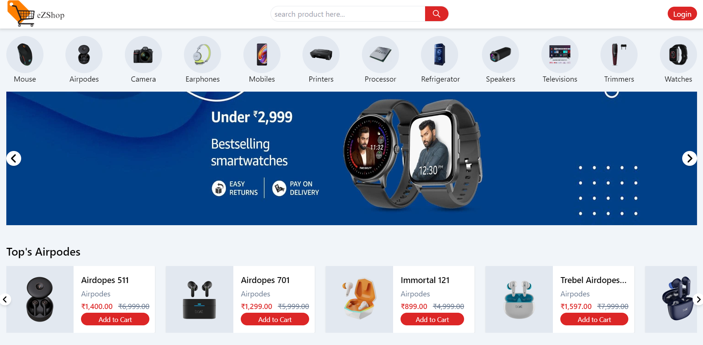

# 🛒 eZShop

**eZShop** is an e-commerce platform built to enhance user experience with a dynamic, responsive interface and powerful backend functionalities. From a seamless shopping experience to secure transactions and an integrated chatbot, eZShop provides an all-in-one solution for modern online shopping.

        

## ✨ Live Demo

Check out the live website here: [**ezshop**](https://ezshop-front.vercel.app/)

## 🚀 Features

### Frontend:
- 🎨 **Responsive Design**: Created a responsive admin panel and user interface using **Tailwind CSS**.
- 🔍 **Enhanced User Experience**: Filtering, search, cart functionality, secure checkout, and image zoom for a seamless shopping experience.
- 🛒 **Dynamic User Interface**: Intuitive product listings, cart views, and checkout flows.

### Backend:
- 🔐 **Authentication**: Implemented **Passport.js** with **JWT** for secure authentication.
- 📧 **Email Notifications**: Automated email notifications and OTP for password resets using **NodeMailer**.
- 💳 **Payment Integration**: Integrated **Stripe** for secure and seamless payment processing.
- 🤖 **Chatbot**: Developed a chatbot using **Transformers**, accessible via **FastAPI**.
  
## 🛠️ Tech Stack

- **Frontend**: React, Redux, Tailwind CSS
- **Backend**: Node.js, Express, MongoDB
- **Authentication**: Passport.js, JWT
- **Payments**: Stripe
- **Email/OTP**: NodeMailer
- **API**: REST APIs
- **Cloudinary**: Image storage and management
- **Deployment**: Vercel

